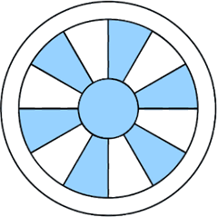

========
Contents
========

**Python Extension to the Swiss Ephemeris** -- *Ephemeris for developers of
astrological softwares*

Original documentation is Copyright Astrodienst AG 1997-2021

:Authors: Dieter Koch and Dr. Alois Treindl
:Website: https://www.astro.com/swisseph
:Mailing-list: https://groups.io/g/swisseph/

.. note::

    This version of the documention, adapted for the Python programming
    language, is a work in progress.
    Head to https://github.com/astrorigin/pyswisseph if you want to
    participate.

.. toctree::
    :maxdepth: 3

    installation
    introduction
    The ephemerides <ephemerides/index>
    programmers_manual/index

Indices and tables
==================

* :ref:`Index of functions <genindex>`

.. * :ref:`modindex`
.. * :ref:`search`

..
